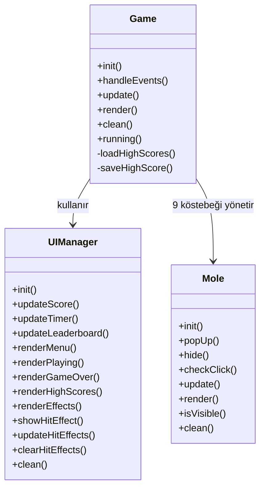
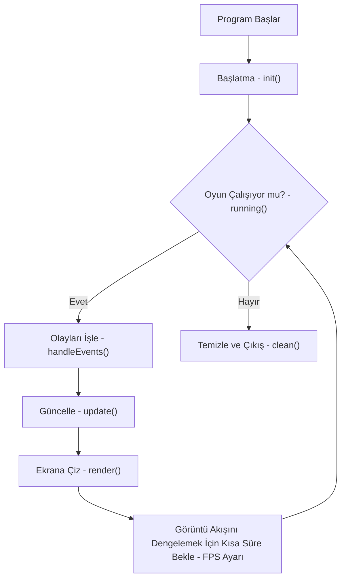
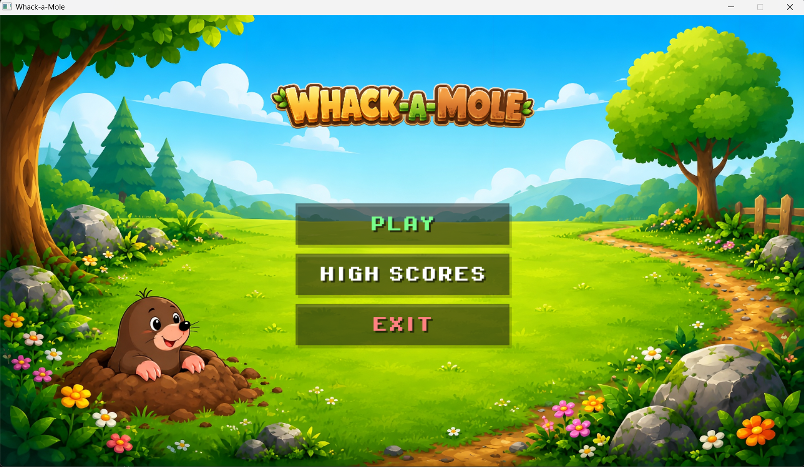
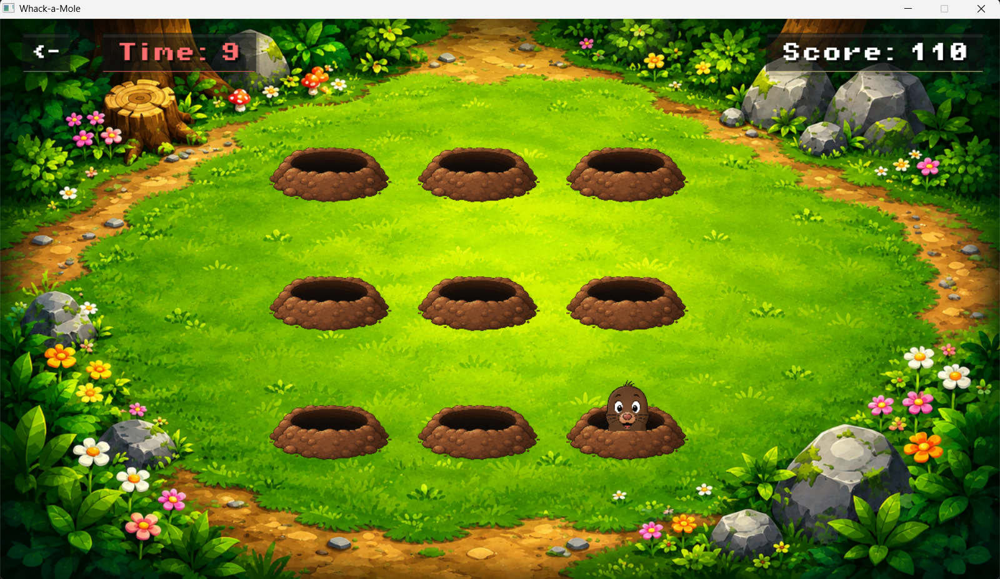
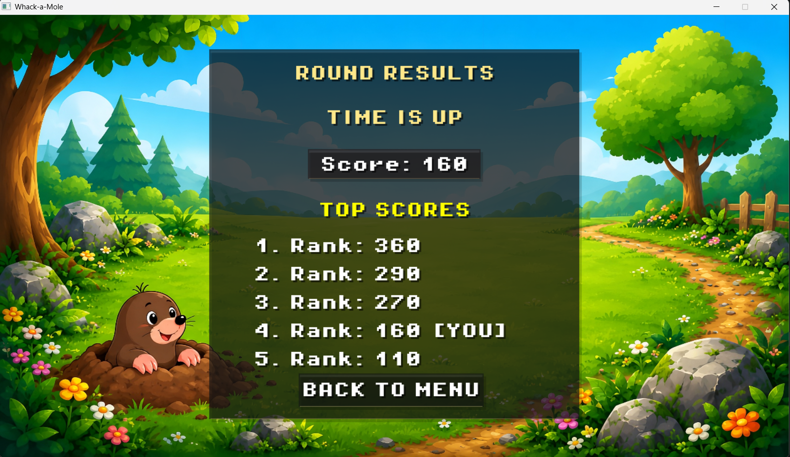
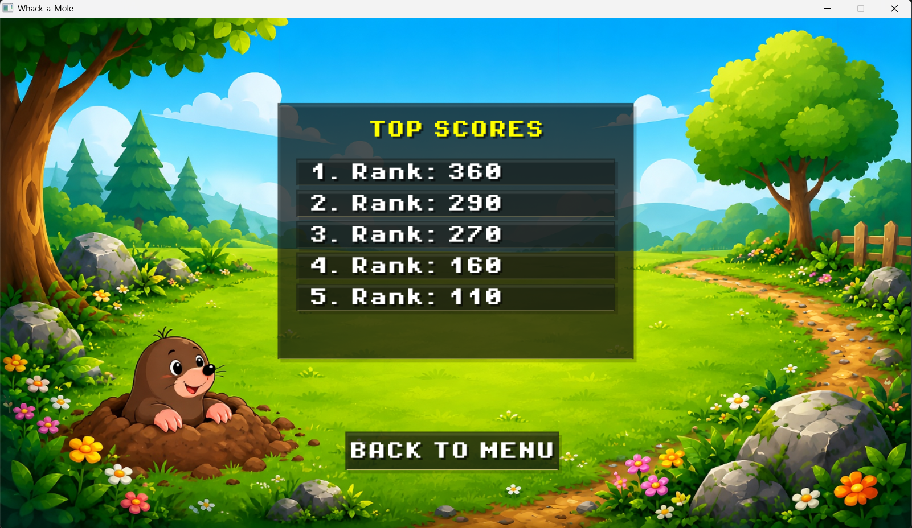

# Whack-a-Mole

## Kocaeli Üniversitesi Yazılım Mühendisliği - Programlama II Dersi Oyun Projesi

## Geliştirici

**Ahmet Melih Çalış**  
**Öğrenci No:** 240229027

## Proje Özeti

Bu proje, **C++** ve **SDL2** kullanılarak geliştirilmiş, zamana karşı oynanan bir **Whack-a-Mole** oyunudur.

Oyuncu, deliklerden rastgele çıkan köstebeklere fare ile tıklayarak puan toplar. Süre dolduğunda oyun sona erer ve sonuç ekranı ile en yüksek skorlar gösterilir.

## Özellikler

- Köstebek çıkış ve giriş animasyonları
- Rastgele delik seçimi
- Fare tıklama algılama ve çarpışma kontrolü
- Skor sayacı ve geri sayım süresi
- Ana menü, sonuç ekranı ve yüksek skorlar ekranı
- En yüksek 5 skoru kaydetme ve listeleme
- Vuruş efekti ve ses desteği

## Kullanılan Teknolojiler

### Programlama Dili

- **C++**

### Kütüphaneler

- **SDL2**
- **SDL2_image**
- **SDL2_ttf**
- **SDL2_mixer**

## Proje Yapısı

```text
Whack-a-Mole/
├── assets/
├── include/
│   ├── Game.h
│   ├── Mole.h
│   └── UIManager.h
├── src/
│   ├── Game.cpp
│   ├── Mole.cpp
│   ├── UIManager.cpp
│   └── main.cpp
├── CMakeLists.txt
└── README.md
```

## Yazılım ve Fonksiyon Mimarisi

Proje, sorumlulukları birbirinden ayıran üç temel sınıf üzerine kurulmuştur:

- **Game**: Oyun döngüsünü, durum geçişlerini, süre yönetimini, skor kaydını ve genel akışı yönetir.
- **Mole**: Köstebeklerin görünürlük durumunu, animasyonlarını, tıklanma kontrolünü ve çizimini yönetir.
- **UIManager**: Menüleri, skor ve süre yazılarını, sonuç ekranlarını ve görsel efektleri yönetir.

### Sınıflar Arası İlişki

---



> **Not:** Bu diyagramda yalnızca projede tanımlanan `Game`, `Mole` ve `UIManager` sınıfları arasındaki ilişki gösterilmiştir. SDL2 ve alt kütüphanelere ait hazır fonksiyonlar bu sınıf diyagramına dahil edilmemiştir.

## Oyun Akışı

1. Oyuncu ana menüden oyunu başlatır.
2. Köstebekler farklı deliklerden rastgele çıkar.
3. Oyuncu görünen köstebeklere tıklayarak puan kazanır.
4. Süre dolunca oyun biter.
5. Sonuç ekranında skor ve yüksek skorlar listesi gösterilir.

### Oyun Akış Diyagramı




## Oyun Görselleri

### Ana Menü



### Oyun Ekranı



### Oyun Sonu Ekranı



### Yüksek Skorlar Ekranı



## Kurulum ve Derleme Rehberi

Proje, **CMake** kullanılarak derlenmek üzere yapılandırılmıştır. Kodu derlemeden önce sisteminizde `C++ Derleyici (GCC/MinGW)`, `CMake` (minimum sürüm 3.16) ve `SDL2` kütüphanelerinin (SDL2, SDL2_image, SDL2_ttf, SDL2_mixer) kurulu olması gerekmektedir.

> **ÖNEMLİ NOT:** Projeyi CMake ile yapılandırmadan önce `build` adında bir derleme dizini oluşturmayı unutmayınız.

### Derleme Adımları (Terminal / Komut Satırı)

1. Proje klasörüne gidin:
```bash
cd Whack-a-Mole
```

2. Derleme dizini oluşturun ve içine girin:
```bash
mkdir build
cd build
```

3. CMake ile projeyi yapılandırın:
```bash
cmake ..
```

4. Projeyi derleyin:
```bash
cmake --build .
```

5. Oyunu çalıştırın:
```bash
# Windows (MSYS2/MinGW) için:
./WhackAMole.exe

# Linux/macOS için:
./WhackAMole
```

## Amaç

Bu projenin amacı, Programlama II dersi kapsamında C++ programlama dili ile nesne yönelimli programlama mantığını kullanarak SDL2 tabanlı etkileşimli bir oyun geliştirmektir.
